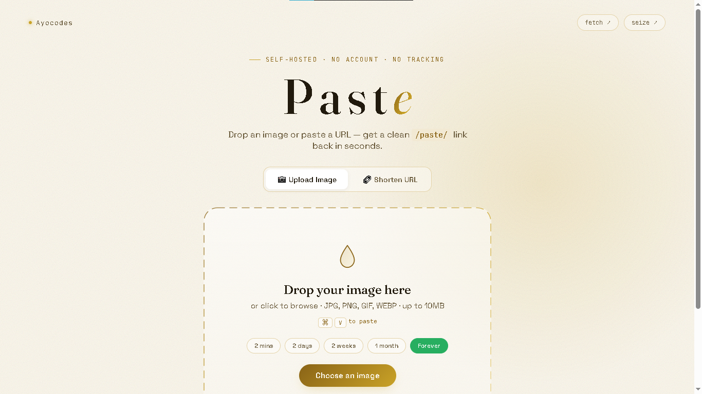
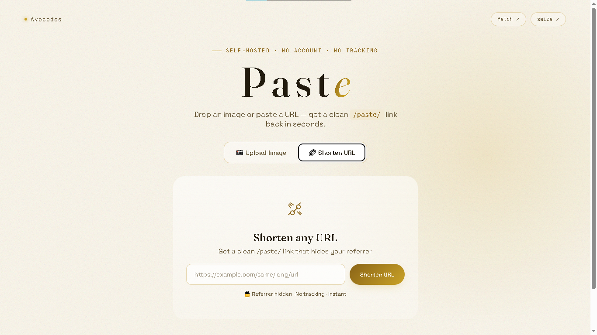
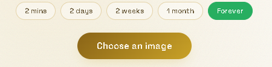

# Paste: Image Hosting & URL Shortener

> Built by [Ayocodes](https://ayocodes-portfolio.vercel.app)

A self-hosted image hosting and URL shortening service with expiration times. No accounts, no tracking, no nonsense.



## ✨ Features

- 📷 **Upload Images** - Drag & drop or paste from clipboard (⌘V)
- ⏰ **Expiration Options** - Choose from:
  - 2 minutes
  - 2 days
  - 2 weeks
  - 1 month
  - Forever
- 🔗 **URL Shortener** - Shorten any URL and hide referrers
- 🔒 **Privacy First** - No tracking, no accounts required, no data collection
- 🎨 **Beautiful UI** - Clean, modern interface with warm cream aesthetic
- ⚡ **Fast** - Lightweight and responsive
- 🗑️ **Delete Links** - Delete your images or shortened links anytime
- 📱 **PWA Support** - Installable on Android and iOS devices

## 🚀 Quick Start

### Prerequisites
- Node.js (v14 or higher)
- npm or yarn

### Installation

```bash
# Clone the repository
git clone https://github.com/Officialay12/paste.git
cd paste

# Install dependencies
npm install

# Start the server
npm start
```

The app will run at `http://localhost:3000`

### Development Mode

```bash
# Run with auto-restart on changes
npm run dev
```

## 📦 Deployment

### Deploy to Render (Recommended)

Render is the easiest way to deploy this app with persistent storage for uploaded images.

1. Fork or clone this repository
2. Push to your GitLab or GitHub account
3. Go to [Render.com](https://render.com) and sign up
4. Click **"New +"** → **"Web Service"**
5. Connect your Git provider and select your repository
6. Configure your service:
   - **Name**: `paste`
   - **Environment**: `Node`
   - **Build Command**: `npm install`
   - **Start Command**: `npm start`
7. Click **"Create Web Service"**

### Add Persistent Storage

Since this app handles file uploads, you need a persistent disk:

1. In Render Dashboard → Your Service → **Settings**
2. Scroll to **Persistent Disk** → Click **Add Disk**
3. Set **Mount Path**: `/opt/render/project/src/uploads`
4. Set **Size**: 1 GB (Free tier allows this)
5. Click **Save**

Your app will be live at `https://paste.onrender.com` within minutes! 🚀

[](https://render.com/deploy?repo=https://github.com/Officialay12/paste)

---

### Deploy to Vercel (Alternative)

Vercel works for serverless deployment but requires external storage for uploads (like Cloudinary).

1. Fork or clone this repository
2. Push to your GitHub account
3. Import to [Vercel](https://vercel.com)
4. Deploy!

[](https://vercel.com/new/clone?repository-url=https://github.com/Officialay12/paste)

> **Note**: Vercel doesn't support persistent file storage. For uploads to work on Vercel, you'll need to modify the code to use cloud storage like Cloudinary or AWS S3.

---

### Deploy to Railway (Alternative)

Another great free alternative with persistent storage.

1. Go to [Railway.app](https://railway.app)
2. Connect your GitHub/GitLab repository
3. Deploy!

---

## 📊 Hosting Comparison

| Platform    | Free Tier | Persistent Storage | Ease of Use | Best For          |
| ----------- | --------- | ------------------ | ----------- | ----------------- |
| **Render**  | ✅ Yes     | ✅ Yes (Disks)      | ⭐⭐⭐⭐⭐       | **This project**  |
| **Vercel**  | ✅ Yes     | ❌ No (Use S3)      | ⭐⭐⭐⭐⭐       | Serverless apps   |
| **Railway** | ✅ Yes     | ✅ Yes              | ⭐⭐⭐⭐        | Simple deployment |
| **Heroku**  | ⚠️ Limited | ✅ Yes              | ⭐⭐⭐⭐⭐       | Legacy apps       |

---

## 🛠️ Tech Stack

### Backend
- **Node.js** - JavaScript runtime
- **Express** - Web framework
- **Multer** - File upload handling
- **File System** - JSON-based data storage

### Frontend
- **HTML5** - Semantic markup
- **CSS3** - Custom design system
- **Vanilla JavaScript** - No frameworks needed
- **Google Fonts** - Fraunces & Space Grotesk

### PWA
- **Service Worker** - Offline support
- **Web App Manifest** - Installable on Android & iOS
- **Apple Touch Icons** - iOS home screen support

### Deployment
- **Render** - Recommended for persistent storage
- **Vercel** - Serverless deployment (with modifications)
- **Git** - Version control

## 📁 Project Structure

```
paste/
├── public/                 # Frontend files
│   ├── index.html         # Main page
│   ├── styles.css         # All styles
│   ├── script.js          # All JavaScript
│   ├── sw.js              # Service Worker (PWA)
│   ├── manifest.json      # Web App Manifest (PWA)
│   ├── favicon.svg        # Favicon
│   └── icons/             # PWA icons
│       ├── icon-72x72.png
│       ├── icon-96x96.png
│       ├── icon-128x128.png
│       ├── icon-144x144.png
│       ├── icon-152x152.png
│       ├── icon-192x192.png
│       ├── icon-384x384.png
│       └── icon-512x512.png
├── screenshots/            # README screenshots
│   ├── upload-mode.png
│   ├── url-shortener.png
│   └── result-expiration.png
├── data/                  # JSON data storage
│   ├── links.json        # Shortened URLs data
│   └── images.json       # Image metadata with expiration
├── uploads/               # Uploaded image files
├── server.js              # Main server application
├── package.json           # Dependencies and scripts
├── render.yaml            # Render deployment config
├── vercel.json            # Vercel deployment config
├── .gitignore             # Git ignore rules
└── README.md              # This file
```

## 🎯 API Endpoints

| Method | Endpoint      | Description                            |
| ------ | ------------- | -------------------------------------- |
| POST   | `/upload`     | Upload an image with expiration option |
| POST   | `/shorten`    | Shorten a URL                          |
| GET    | `/paste/:id`  | Access image or shortened URL          |
| DELETE | `/delete/:id` | Delete an image                        |
| DELETE | `/link/:id`   | Delete a shortened URL                 |
| GET    | `/health`     | Health check endpoint                  |

### Example Usage

**Upload an image:**
```bash
curl -X POST -F "image=@photo.jpg" -F "expiration=2days" http://localhost:3000/upload
```

**Shorten a URL:**
```bash
curl -X POST -H "Content-Type: application/json" -d '{"url":"https://example.com/very/long/url"}' http://localhost:3000/shorten
```

## 💡 How It Works

### Image Upload
1. User uploads image (drag & drop, click, or paste)
2. User selects expiration time (2min, 2days, 2weeks, 1month, forever)
3. Server saves image with metadata including expiration
4. Returns a clean `/paste/:id` link
5. Background cleanup runs every 60 seconds to remove expired images

### URL Shortening
1. User pastes a URL
2. Server generates a unique 8-character ID
3. Saves mapping in `links.json`
4. Returns a `/paste/:id` link
5. When visited, redirects with referrer hidden

## 🔒 Privacy & Security

- **No Tracking**: No analytics, no cookies, no tracking pixels
- **No Accounts**: No registration required
- **Referrer Hiding**: Shortened URLs strip referrer information
- **File Validation**: Only image files allowed (JPG, PNG, GIF, WEBP)
- **Size Limiting**: Maximum 10MB file size
- **Path Traversal Protection**: Input sanitization for file operations

## ⏰ Expiration Logic

| Option  | Duration      | Use Case                          |
| ------- | ------------- | --------------------------------- |
| 2 mins  | 120 seconds   | Temporary sharing, quick previews |
| 2 days  | 48 hours      | Short-term sharing, collaboration |
| 2 weeks | 14 days       | Medium-term storage               |
| 1 month | 30 days       | Extended sharing                  |
| Forever | Never expires | Permanent storage                 |

Expired images are automatically deleted from the server every 60 seconds.

## 🎨 Design System

### Colors
- `--cream-50`: #FBF7EC (Background)
- `--cream-100`: #F2E9D3 (Light accents)
- `--cream-200`: #E4D3A9 (Borders)
- `--ink-900`: #211a0d (Text)
- `--ink-600`: #6b5c3d (Subtle text)
- `--gold-300`: #ecd48a (Light gold)
- `--gold-500`: #c9a227 (Primary gold)
- `--gold-700`: #8a6417 (Dark gold)

### Typography
- **Headings**: Fraunces (Serif)
- **Body**: Space Grotesk (Sans-serif)
- **Code**: JetBrains Mono (Monospace)

## 📸 Screenshots

### Upload Mode


### URL Shortener Mode


### Result with Expiration


## 📱 PWA Installation

### On Android
1. Open Chrome and visit your site
2. Tap the three-dot menu
3. Select "Add to Home screen"
4. Tap "Install" - the app will open in full screen!

### On iOS
1. Open Safari and visit your site
2. Tap the Share button
3. Scroll down and tap "Add to Home Screen"
4. Tap "Add" - the app will open in full screen!

## 🤝 Contributing

Contributions are welcome! Here's how:

1. Fork the repository
2. Create a new branch: `git checkout -b feature/amazing-feature`
3. Make your changes
4. Commit: `git commit -m 'Add amazing feature'`
5. Push: `git push origin feature/amazing-feature`
6. Open a Pull Request

## 📄 License

MIT License - feel free to use for personal or commercial projects.

## 👨‍💻 Author

**Ayomide O.** (Ayocodes)
- Portfolio: [ayocodes-portfolio.vercel.app](https://ayocodes-portfolio.vercel.app)
- GitHub: [@Officialay12](https://github.com/Officialay12)
- Twitter: [@ayocodes](https://twitter.com/ayo_c0des)

## 🙏 Acknowledgments

- Fonts: [Fraunces](https://fonts.google.com/specimen/Fraunces) & [Space Grotesk](https://fonts.google.com/specimen/Space+Grotesk)
- Icons: Custom SVG icons
- Inspiration: Clean, minimal design principles

## 🚀 Roadmap

- [ ] Cloud storage support (S3, Cloudinary)
- [ ] Custom short URLs
- [ ] QR code generation
- [ ] Password protection for links
- [ ] API rate limiting
- [ ] Image optimization
- [ ] Dark mode toggle
- [ ] Analytics dashboard

## ⭐ Support

If you find this project useful, please give it a star ⭐ on GitHub!

---

**Built by Ayocodes**
